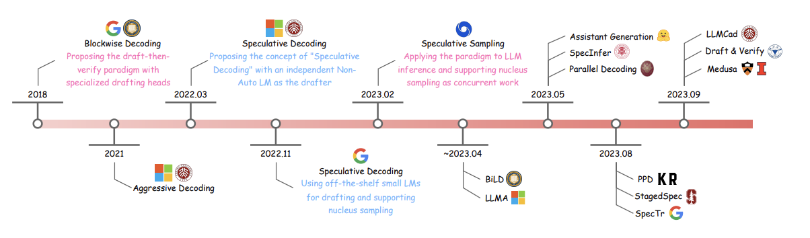

# Speculative Decoding 

A curated list of research papers on speculative decoding and their contributions to improving performance in large language model inference.

# Speculative Decoding Research Papers

**Title**                                                                                   | **Authors**                                     | **Publication Date** | **Performance** | **Link**                                                                                   |
|--------------------------------------------------------------------------------------------|------------------------------------------------|----------------------|-----------------|-------------------------------------------------------------------------------------------|
| Fast Inference from Transformers via Speculative Decoding                                  | Daniel Kang, Yi Sun, Dan Fu, et al.            | November 2022        | ⭐⭐⭐⭐           | [Link](https://arxiv.org/abs/2211.17192)                                             |
| Decoding Speculative Decoding                                                              | Minghao Yan, Saurabh Agarwal, Shivaram Venkataraman | February 2024       | ⭐⭐⭐⭐⭐          | [Link](https://arxiv.org/abs/2402.01528)                                             |
| SpecTr: Fast Speculative Decoding via Optimal Transport                                    | Ziteng Sun, Ananda Theertha Suresh, et al.     | October 2023         | ⭐⭐⭐⭐           | [Link](https://arxiv.org/abs/2310.15141)                                             |
| SpecDec++: Boosting Speculative Decoding via Adaptive Candidate Lengths                    | Kaixuan Huang, Xudong Guo, Mengdi Wang         | May 2024             | ⭐⭐⭐⭐⭐          | [Link](https://arxiv.org/abs/2405.19715)                                             |
| Unlocking Efficiency in Large Language Model Inference: A Comprehensive Survey of Speculative Decoding | Heming Xia, Zhe Yang, et al.                   | January 2024         | ⭐⭐⭐⭐⭐          | [Link](https://arxiv.org/abs/2401.07851)                                             |

## Drafting

Drafting refers to the process of generating high-quality drafts or predictions in speculative decoding pipelines. It includes two key approaches: **Independent Drafting**, which relies on pre-trained or fine-tuned models for drafting, and **Self-Drafting**, which integrates adaptive mechanisms like early exiting or mask-based predictions to refine outputs.

### Independent Drafting
| **Title**                                   | **Authors**           | **Publication Date** | **Performance** | **Link**                                   |
|---------------------------------------------|-----------------------|----------------------|-----------------|--------------------------------------------|
| SpecDec                                     | Xia et al.            | 2023                 | ⭐⭐⭐⭐           | [Link](https://arxiv.org/abs/2211.17192) |
| BiLD                                        | Kim et al.            | 2023                 | ⭐⭐⭐⭐           | [Link](https://example.com)          |
| SpecInfer                                   | Miao et al.           | 2024                 | ⭐⭐⭐⭐⭐          | [Link](https://example.com)          |
| Online Speculative                          | Liu et al.            | 2023                 | ⭐⭐⭐⭐           | [Link](https://example.com)          |
| DistillSpec                                 | Zhou et al.           | 2023                 | ⭐⭐⭐⭐⭐          | [Link](https://example.com)          |

### Self-Drafting
Self-Drafting leverages iterative and adaptive strategies to improve draft generation. These methods employ techniques like blockwise generation, self-speculative predictions, and mask-predict algorithms to achieve faster inference while maintaining quality.

| **Title**                                   | **Authors**           | **Publication Date** | **Performance** | **Link**                                   |
|---------------------------------------------|-----------------------|----------------------|-----------------|--------------------------------------------|
| Blockwise                                   | Stern et al.          | 2018                 | ⭐⭐⭐⭐           | [Link](https://example.com)          |
| Medusa                                      | Cai et al.            | 2024                 | ⭐⭐⭐⭐⭐          | [Link](https://example.com)          |
| EAGLE                                       | Li et al.             | 2024                 | ⭐⭐⭐⭐⭐          | [Link](https://example.com)          |
| PPD                                         | Yang et al.           | 2023b                | ⭐⭐⭐⭐           | [Link](https://example.com)          |
| Self-Speculative                            | Zhang et al.          | 2023a                | ⭐⭐⭐⭐           | [Link](https://example.com)          |
| SPEED                                       | Hooper et al.         | 2023                 | ⭐⭐⭐⭐⭐          | [Link](https://example.com)          |
| Mask-Predict                                | Santilli et al.       | 2023                 | ⭐⭐⭐⭐           | [Link](https://example.com)          |

---

## Verification

Verification involves validating or refining the drafts produced during speculative decoding. These methods ensure that outputs are either lossless or approximate but still align closely with model-generated results. Techniques include **Greedy Decoding**, which optimizes one step at a time, **Speculative Sampling**, and **Token Tree Verification** for structured data validation.

### Greedy Decoding
Greedy Decoding methods verify drafts in a step-by-step manner, ensuring that outputs closely align with the ground truth. These lossless or approximate methods include blockwise and parallel decoding.

| **Title**                                   | **Authors**           | **Publication Date** | **Performance** | **Link**                                   |
|---------------------------------------------|-----------------------|----------------------|-----------------|--------------------------------------------|
| Blockwise                                   | Stern et al.          | 2018                 | ⭐⭐⭐⭐           | [Link](https://example.com)          |
| SpecDec                                     | Xia et al.            | 2023                 | ⭐⭐⭐⭐           | [Link](https://example.com)          |
| Parallel Decoding                           | Santilli et al.       | 2023                 | ⭐⭐⭐⭐           | [Link](https://example.com)          |

### Speculative Sampling
Speculative Sampling enhances verification by leveraging sampling-based approaches to speed up decoding. These techniques focus on balancing efficiency with maintaining high accuracy.

| **Title**                                   | **Authors**           | **Publication Date** | **Performance** | **Link**                                   |
|---------------------------------------------|-----------------------|----------------------|-----------------|--------------------------------------------|
| Speculative Decoding                        | Leviathan et al.      | 2023                 | ⭐⭐⭐⭐⭐          | [Link](https://example.com)          |
| DistillSpec                                 | Zhou et al.           | 2023                 | ⭐⭐⭐⭐⭐          | [Link](https://example.com)          |
| Online Speculative                          | Liu et al.            | 2023                 | ⭐⭐⭐⭐           | [Link](https://example.com)          |
| SpS                                         | Chen et al.           | 2023a                | ⭐⭐⭐⭐           | [Link](https://example.com)          |

### Token Tree Verification
Token Tree Verification is used for structured data outputs, ensuring token-level alignment with ground truth. This approach often employs graph-based methods for rigorous validation.

| **Title**                                   | **Authors**           | **Publication Date** | **Performance** | **Link**                                   |
|---------------------------------------------|-----------------------|----------------------|-----------------|--------------------------------------------|
| SpecInfer                                   | Miao et al.           | 2024                 | ⭐⭐⭐⭐⭐          | [Link](https://example.com)          |
| StagedSpec                                  | Spector and Re        | 2023                 | ⭐⭐⭐⭐           | [Link](https://example.com)          |
| SpecTr                                      | Sun et al.            | 2023                 | ⭐⭐⭐⭐           | [Link](https://example.com)          |
| REST                                        | He et al.             | 2023                 | ⭐⭐⭐⭐⭐          | [Link](https://example.com)          |
| Medusa                                      | Cai et al.            | 2024                 | ⭐⭐⭐⭐⭐          | [Link](https://example.com)          |
| EAGLE                                       | Li et al.             | 2024                 | ⭐⭐⭐⭐⭐          | [Link](https://example.com)          |

---